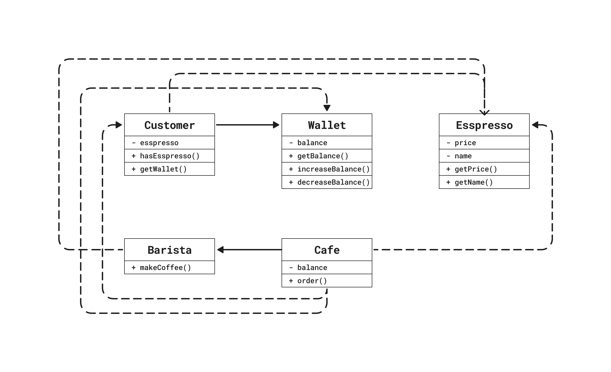
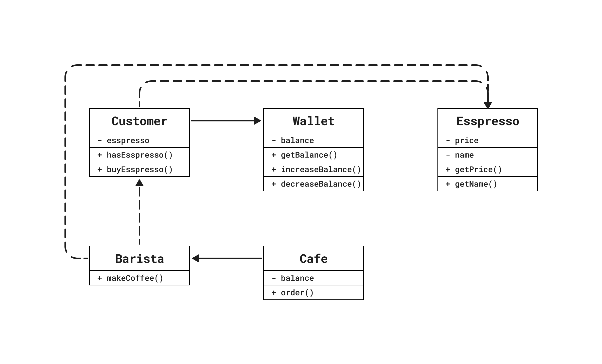

## 개요

실무에서 TypeScript를 사용하면서 객체지향의 중요성을 점점 더 깨닫고 있습니다.

특히 NestJS 프레임워크를 사용하면서 더욱 객체지향의 중요성을 느끼고 있습니다. 프레임워크에서 강조하는 SOLID 원칙은 유지보수가 쉬운 코드를 작성하는 데 중요한 역할을 합니다. SOLID 원칙은 객체지향 프로그래밍의 기본 개념으로, 이를 이해하고 적용함으로써 추후에 다른 유용한 프레임워크나 라이브러리를 습득하여 손쉽게 활용할 수 있습니다.


이러한 인사이트를 얻게 된 계기는 향로님의 인터뷰였습니다. 인터뷰 내용 중 <a href="https://product.kyobobook.co.kr/detail/S000001766367">조영호님의 오브젝트</a>라는 책을 알게되었고, 이를 계기로 객체지향에 대해 모호하게 이해하고 있던 부분들을 명확히 공부하고자 글을 작성해 보려고 합니다.

### 학습 목표

- 패러다임과 절차지향
- 예제로 알아보는 취약한 코드
- 취약한 코드 리팩토링


## 패더라임과 절차지향

객체지향을 알아보기 전에 패러다임과 절차지향에 대해 알아봅시다.

객체지향은 프로그래밍 패러디임 중 하나입니다. 그 이전에 절차지향이 있었으며, 절차지향의 문제점을 해결하기 위한 패러다임 중 객체지향 프로그래밍이 등장하였습니다.

### 패러다임

우선 패러다임에 대해 알아봅시다. 위키에서는 패러다임을 다음과 같이 정의합니다.

	"'패러다임'은 어떤 한 시대 사람들의 견해나 사고를 근본적으로 규정하고 있는 테두리로서의 인식의 체계, 또는 사물에 대한 이론적인 틀이나 체계를 의미하는 개념"

프로그래밍 패러다음은 '문제를 어떻게 풀 것인가?'에 초점이 맞춰져 있습니다. 즉 문제 풀이 방법을 공동의 개발자가 서로 공유하는 것으로, 프로그래밍 모델 및 스타일이라고 할 수 있습니다.

간단히 말해서 **어떤 프로그래밍 패러다임을 사용하느냐에 따라 문제를 바라보는 방식과 프로그래밍 방법이 달라집니다.**

### 절차를 지향하다

**프로세스와 데이터가 별도로 위치시키는 방식을 절차지향 프로그래밍(Procedural Programming)이라고 합니다.**

프로세스는 작업을 말합니다. 이러한 작업은 제어 흐름을 나타내며 프로그램의 로직을 정의합니다. 이러한 작업에서 사용되는 정보의 집합은 데이터입니다. 데이터는 프로그램이 처리하는 입력, 출력, 결과 등을 포함합니다.

이러한 절차적 프로그래밍 방식은 우리의 직관을 벗어납니다. 이러한 세계에서는 어떠한 대상도 수동적인 존재입니다. 절차적 프로그래밍 세계에서는 우리의 예상을 쉽게 벗어나기 떄문에 코드를 읽는 사람과 원할하게 소통하지 못합니다.

책에서 프로그래밍을 글로 설명하는 것은 비효율적인 방법이라고 합니다. 프로그래밍은 실무이고 실무적 예제를 통해 객체지향을 이해시키고 있습니다. 이제부터는 애플리케이션 예제를 통해 절차적 프로그래밍과 객체지향 프로그래밍에 대해 알아봅시다.


---

## 예제로 알아보는 취약한 코드

 '취약한 코드'란 무엇일까요? 우선 모듈이 가져야할 기능에 대해 알아봅시다. 로버트 마틴은 **소프트웨어 모듈이 가져야 하는 세 가지 기능**을 다음과 같이 설명합니다.

✅ 실행 중에 제대로 실행돼야 한다.
✅ 변경을 위해 존재하는 한다.
✅ 코드를 읽는 사람과 의사소통이 원활해야 한다.

소프트웨어 모듈이 가져야할 세 가지 기능 모두를 만족하는 코드가 가장 이상적일 것입니다. 하지만 실무에서는 어떠한 상황이 있을지 모릅니다. 위 세 가지 기능을 만족하는 코드를 작성하면 좋겠지만 그럴 수 없는 상황도 있겠지요.

그럼에도 불구하고 개발자는 이상적인 코드를 작성할 수 있도록 노력해야 합니다. 이제부터 예제를 통해 취약한 코드란 무엇이며 어떻게 객체지향적으로 개선할지에 대해 알아보도록 합시다.

### 예제: 카페 주문 애플리케이션

예제를 통해 취약한 코드란 무엇이며 어떻게 객체를 지향하는 코드로 개선할지에 대해 알아보도록 하겠습니다.


애플리케이션 요구사항은 다음과 같습니다.

1. 고객은 카페에 방문하여 금액을 지불하고 에스프레소를 주문을 합니다.
2. 주문을 받은 바리스타는 에스프레소를 만듭니다.
3. 완성된 메뉴를 고객에게 전달합니다.

#### Espresso, Wallet, Customer 클래스

먼저 각각의 요소들을 파악해보겠습니다.

요구사항 중 '고객이 금액을 지불하고 에스프레소를 주문'하는 것이 있습니다. 여기서 요소는 '고객'과 '에스프레소' 그리고 금액을 지불하기 위한 '지갑' 정도가 있겠네요. 그럼 이제 고객(Customer), 에스프레소(Espresso), 지갑(Wallet)에 대한 개념을 구현하기 위해 클래스를 작성해보겠습니다.

첫 번째로 고객이 주문할 메뉴인 에스프레소(Esspresso)입니다. Espresso 클래스는 기본적으로 가격(price)과 이름(name)을  포함하고 있습니다.

```typescript
class Espresso {
  private readonly price = 2.5;
  private readonly name = 'Espresso';

  getPrice() {
    return this.price;
  }

  getName() {
    return this.name;
  }
}
```

두 번째로 지갑(Wallet)입니다. Wallet 클래스는 고객이 소유할 금액을 보관하는 용도로 사용됩니다.

```typescript
class Wallet {
  constructor(private balance: number) {}

  getBalance(): number {
    return this.balance;
  }

  increaseBalance(amount: number) {
    this.balance += amount;
  }

  decreaseBalance(amount: number) {
    this.balance -= amount;
  }
}
```

마지막으로 고객(Customer)입니다. Customer는 Espresso와 Wallet을 소요할 수 있으며, Wallet의 경우는 필수로 소유하고 있습니다.

```typescript
class Customer {
  private espresso: Espresso | null = null;

  constructor(private readonly wallet: Wallet) {}

  hasEsspresso(): boolean {
    return this.espresso !== null;
  }

  setEspresso(espresso: Espresso) {
    this.espresso = espresso;
  }

  getWallet(): Wallet {
    return this.wallet;
  }
}
```

#### Barista, Cafe 클래스

주문을 받을 '카페'와 에스프레소를 고객에게 전달할 '바리스타' 개념을 구현해보겠습니다.

먼저 바리스타(Barista)는 커피를 제조할 수 있는 makeCoffee 메서드가 있습니다.

```typescript
class Barista {
  makeCoffee(): Espresso {
    const espresso = new Espresso();
    return espresso;
  }
}
```

마지막으로 카페(Cafe)입니다. Cafe 클래스는 금액(balance)과 바리스타(barista)를 소유 하고 있으며 주문을 받는 order 메서드가 있습니다.

카페에서 주문을 받으면 바리스타가 에스프레소를 제조하고 고객에게 전달합니다. 고객은 지갑에서 에스프레소 금액을 지불하고, 지불된 금액만큼 카페의 balance를 증가합니다. 

```typescript
class Cafe {
  constructor(private balance: number, private readonly barista: Barista) {}

  order(customer: Customer) {
    const espresso = this.barista.makeCoffee();
    const amount = espresso.getPrice();

    customer.getWallet().decreaseBalance(amount);
    customer.setEspresso(espresso);
    this.balance += amount;
  }
}
```

>해당 코드는 <a href="https://github.com/boy672820/oop-example/tree/main/src/cafe">Github</a>에서 확인하실 수 있습니다.

### 문제점 파악

앞에서 작성한 예제 카페 주문 애플리케이션은 무엇이 문제일까요?

예제의 문제점은 변경에 취약하고 우리의 예상과 벗어나게 동작한다는 것입니다. 예제는 첫장에 말했었던 취약한 코드의 예시라고 볼 수 있습니다.

로버트 마틴이 말했던 **소프트웨어 모듈이 가져야 하는 세 가지 기능**에 대해 다시 한 번 확인해보겠습니다.

✅ 소프트웨어 모듈은 실행 중에 제대로 실행돼야 한다.
✅ 소프트웨어 모듈은 변경을 위해 존재하는 한다.
✅ 소프트웨어 모듈은 코드를 읽는 사람과 의사소통이 원활해야 한다.

우리가 작성한 예제 애플리케이션의 중요한 기능인 '주문을 받고 에스프레소를 고객에게 전달한다'는 제대로 동작하는거 같습니다. 따라서 첫 번째 조건인 '실행 중에 제대로 실행돼야 한다'는 만족시키고 있습니다.

하지만, 우리가 작성한 예제 애플리케이션은 소프트웨어 모듈의 세 가지 기능 중 두 번째와 마지막 조건은 만족하지 않습니다. 예제 애플리케이션은 '변경에 취약'하며 '읽는 사람과 의사소통이 원할'하지는 않는 코드입니다.

#### 문제점#1: 예상과 벗어나게 동작

첫 번째 문제점은 코드가 인간의 예상에 벗어나게 동작한다는 것입니다. 먼저 Cafe 클래스의 order 메서드가 수행하는 일을 확인해보겠습니다.

```typescript
/**
 * order
 * 
 * @param {Customer} customer
 *
 * 주문 메서드는 다음과 같이 동작합니다.
 * 
 * 1. 주문 메서드가 호출되면 바리스타가 에스프레소를 제조합니다.
 * 2. 에스프레소의 금액을 가져옵니다.
 * 3. 고객의 지갑을 가져와 에스프레소 금액 만큼 차감합니다.
 * 4. 고객에게 에스프레소를 전달합니다.
 * 5. 고객의 지갑에 차감된 금액만큼 소유금액(balance)를 증가시킵니다.
 */
order(customer: Customer) {
  const espresso = this.barista.makeCoffee();
  const amount = espresso.getPrice();

  customer.getWallet().decreaseBalance(amount);
  customer.setEspresso(espresso);
  this.balance += amount;
}
```

주석에서 설명된 order 메서드는 우리의 예상을 많이 벗어납니다. 이 코드에서 카페는 고객의 지갑을 마음대로 가져와 금액을 가져갑니다. 현실세계에서 이러한 행동은 말이 안되는 행동이지요.

#### 문제점2: 변경에 취약한 코드

또한 고객과 바리스타는 카페의 통제를 받는 수동적인 존재라는 것입니다. 카페의 주문이 들어오면 다른 요소들은 데이터로서 취급을 받을 뿐 행동(behavior)을 취하는 주체는 카페입니다.

이러한 구조는 변경이 발생하면 코드 전체가 깨지기 쉽습니다. 예를 들어, 현금 결제가 아닌 카드 결제 추가, 고객이 주문할 수 있는 메뉴가 추가된다면 어떨까요? order 메서드를 비롯하여 Cafe에 의존하고 있는 다른 객체들의 코드가 전반적으로 흔들릴 것입니다.

이러한 문제는 객체 사이의 **의존성(dependency)** 과 관련된 문제입니다. 카페는 고객, 바리스타, 지갑에 의존하고 있으며, 만약 이들 중 하나라도 변경된다면 카페 또한 변경될 가능성이 매우 높습니다. 즉, 의존성은 변경과 관련되어 있습니다. 

그렇다고 해서 객체 사이의 의존성을 완전히 없애는 것이 정답은 아닙니다. 객체지향 설계는 서로 의존하면서 협력하는 객체들의 공동체를 구축하는 것입니다. 따라서 애플리케이션 기능을 구현하는데 필요한 최소한의 의존성만을 유지하면서 불필요한 의존성을 제거하는 것이 올바른 설계라고 볼 수 있습니다.

다음은 현재 예제 애플리케이션의 클래스 다이어그램입니다.



클래스 다이어그램를 확인해보면 카페는 불필요하게 많은 객체에 의존하고 있다는 것을 확인할 수 있습니다. 이제 최소한의 의존성만을 남기면서 불필요한 의존성을 제거하여 올바른 코드로  **리팩토링(refactoring)** 해보겠습니다.

## 취약한 코드 리팩토링

코드를 이해하기 어려운 이유는 Cafe 객체가 고객의 지갑에 직접 접근하기 때문입니다. 이것은 고객이 금액을 지불한다는 우리의 직관에 벗어납니다. 다시 말해 코드를 읽는 개발자와 코드가 의사소통을 제대로 못하기 때문에 코드를 이해하기 어려워진 것입니다.

Cafe 객체가 고객의 지갑에 직접 접근한다는 것은 Customer와 결합된다는 것을 의미하고, Customer를 변경할 때 Cafe도 함께 변경해야 하기 때문에 전체적인 코드를 변경하기도 어려워집니다.

해결 방법은 간단합니다. Cafe 객체가 Customer 객체에 대해 세세한 부분까지 알지 못하도록 정보를 차단하면 됩니다. 다시 말해 고객을 '자율적인 존재'로 만들면 되는 것입니다.

### 자율성 부여

Cafe 객체가 Customer에 접근하지 못하도록 Customer 객체에 자율성을 부여해보도록 하겠습니다.

먼저 Customer가 자율적인 존재가 되도록 getWallet 메서드를 제거하고 buyEspresso 메서드를 추가하겠습니다. buyEspresso() 메서드는 자신의 지갑에 에스프레소 가격만큼 금액을 차감하고 결제한 금액을 반환합니다.

```typescript
class Customer {
  private espresso: Espresso | null = null;

  constructor(private readonly wallet: Wallet) {}

  hasEsspresso(): boolean {
    return this.espresso !== null;
  }

  buyEspresso(espresso: Espresso): number {
    this.espresso = espresso;
    this.wallet.decreaseBalance(espresso.getPrice());
    return espresso.getPrice();
  }
}
```

Customer의 getWallet 메서드를 제거하면 다음과 같은 이점이 있습니다.

- Customer에 마음대로 접근할 수 없기 때문에 변경이 유연해집니다.
- Customer에 코드 변경이 발생해도 Cafe는 더 이상 영향을 받지 않습니다.

이제 Cafe 객체의 order 메서드를 리팩토링 해보도록 하겠습니다. 기존에 Customer의 getWallet 메서드를 통해 직접 금액을 차감했던 코드를 지우고, 다음과 같이 바리스타가 buyEspresso 메서드를 호출합니다. 이후 결제된 금액만큼 Cafe의 금액을 증가합니다.

```typescript
class Barista {
  makeCoffee(customer: Customer): number {
    const espresso = new Espresso();
    return customer.buyEspresso(espresso);
  }
}

class Cafe {
  constructor(private balance: number, private readonly barista: Barista) {}

  order(customer: Customer) {
    this.balance += this.barista.makeCoffee(customer);
  }
}
```

Cafe는 주문을 받으면 Barista의 makeCoffee 메서드만 접근할 뿐 더 이상 Customer에 직접 관여할 수 없습니다. 금액을 지불하는 것은 단지 Customer이며 어떤 방식으로 금액을 지불하는지 알 수 없습니다.

리팩토링을 통해 Customer와 Barista에게 책임을 분배하였습니다. 이제 Customer와 Barista는 스스로 자신의 일을 처리합니다. 결과적으로 두 객체는 변경하기 쉬운 객체가 되었으며, 우리의 직관에 벗어나지 않는 즉, 의사소통이 가능한 코드로 개선되었습니다.

아래는 개선된 코드의 클래스 다이어그램입니다.



기존 취약한 코드와 비교했을 때 Cafe는 Customer, Wallet에게 있던 의존성이 제거된 것을 확인할 수 있습니다.


---

## 정리

이번 학습을 마무리하겠습니다.

- 예제 카페 주문 애플리케이션의 수정하기 전 코드는 절차지향의 전형적인 의존성 구조입니다. Cafe는 프로세스(process)이며 Barista, Customer, Wallet은 데이터(Data)처럼 동작하였습니다.
- 예제 코드를 객체를 지향하는 방향으로 리팩토링해 보았습니다. 리팩토링 전 코드와 이후 코드의 근본적인 차이는 '책임의 이동'입니다.(여기서 책임은 기능을 가리키는 객체지향 세계의 용어입니다.)
- 여기서 주요하게 살펴봐야 할 것은, 리팩토링 전 절차지향 코드에서 Cafe에 책임이 집중되어 있다는 것입니다.

조영호님의 '오브젝트'에서는 좋은 설계를 다음과 같이 정의하고 있습니다:

	"좋은 설계란 오늘 요구하는 기능을 온전히 수행하면서 내일의 변경을 매끄럽게 수용할 수 있는 설계이다."

결국 코드는 변경이 필연적입니다. 코드의 변경은 버그 발생 가능성을 높이며, 이로 인해 개발자는 버그로 인한 두려움으로부터 피하려는 경향이 나타납니다.

저는 객체지향이 이러한 버그로 인한 두려움을 극복하기 위한 한 가지 방법이라고 생각합니다. 객체지향은 다양한 설계 중 하나에 불과할지도 모르지만, 앞으로도 유용하게 사용될 패러다임임에 틀림이 없다고 생각합니다.